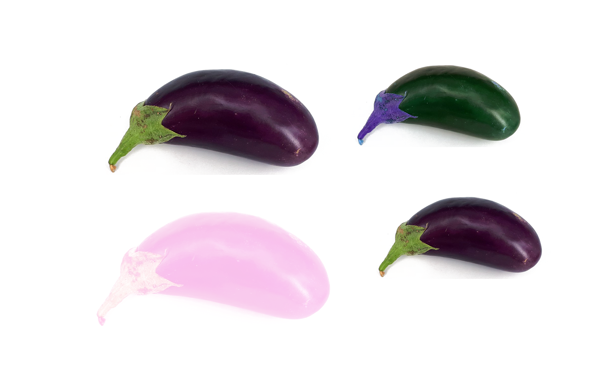

# Robótica Computacional

## Avaliação Inicial - P1

Observações de avaliações nesta disciplina:

* Esta prova tem 10 pontos, mas seu efeito é de substituir a P1 anterior com no máximo conceito $5.0$

Orientações gerais:

* Você tem dois robôs disponíveis. Conte com apenas 20 minutos efetivos de funcionamento ou 30-40 minutos de *standby* para cada robô. Não deixe seu robô ligado sem necessidade
* Todas as questões de ROS podem ser feitas com robô real ou simulado
* As questões de OpenCV podem ser feitas em qualquer sistema operacional, desde que tenham OpenCV 3.4.4
* Você pode consultar a *Internet* livremente, mas não pode se comunicar com outras pessoas da turma ou de fora dela sobre o conteúdo da prova. Tentativas de comunicação serão severamente punidas.
* Ao final da prova, compacte a pasta com todo o seu código e envie pelo Blackboard.
* A responsabilidade por ter o *setup* funcionando é de cada estudante

Existe algumas dicas de referência rápida de setup [instrucoes_setup.md](instrucoes_setup.md)

# Questões

## Questão 1 - OpenCV e Visão

Você foi contratada para desenvolver um sistema de visão computacional que vai trabalhar com classificaćão de berinjelas que passam por uma esteira.

O cliente passou para você o que considera uma cor ideal de berinjela

Passou também um exemplo de imagem como a que seu sistema vai ter que classificar, está no arquivo `img_prova_eggplant.png`.

Dicas:

* Lembre-se da aula 2
* Esta questão pode ser feita em Python ou Jupyter
* Não é uma questão de ROS. Trabalhe na pasta `q1_opencv`
* Você pode usar Python 2 ou Python 3 conforme preferir (só nesta questão)

|Resultado| Conceito| 
|:---------------------------------------|:------:|
| Não executa | 0 |
| Encontra máscara que seleciona berinjelas certas parcialmente | 1.0 |
| Encontra máscara que seleciona as berinjelas certas totalmente | 2.5|
| Identifica a maior berinjela | 3.0 |
| Numera a maior e a menor berinejla certa | 4.0 | 

Casos intermediários ou omissos da rubrica serão decididos pelo professor.

## Questão 2 - ROS

Vamos trabalhar com o tópico `/odom` , que traz os dados de odometria do robô

Existe um exemplo em que você pode se basear chamado `print_odom.py` e que está na pasta `scripts`. 

O que você deve fazer: Um programa que faz o robô avanćar linearmente e para depois de ter percorrido uma distância de $2.0m$, *mas* que para imediatamente se qualquer objeto chegar a uma distância menor que 50cm do robô (detectado via LIDAR).

|Resultado| Conceito| 
|:---------------------------------------|:------:|
| Não executa | 0 |
| Anda 2m somente | 2.0 |
| Tem detećão de eventos de LIDAR mas falha em parar perfeitamente | 2.75 | 
| Anda 2m e para perfeitamente quando um objeto a menos de 50cm é detectado| 4.0 |

Casos intermediários ou omissos da rubrica serão decididos pelo professor.

## Questão 3

Esta é uma discussão mais conceitual.

Se você fosse encarregado de fazer um sistema que detecta vacas e porcos que passam por um trecho de estrada usando câmeras, como faria?

As ferramentas que usamos no curso estariam prontas para serem usadas? Quais? Cite técnicas/ferramentas/bibliotecas.

Se faltasse alguma coisa às ferramentas, o que precisaria ser feito? 

|Resultado| Conceito| 
|:---------------------------------------|:------:|
| Não respondeu | 0 |
| Citou técnicas que se aplicariam ao problema | 1.00 |
| Citou exemplos de ferramentas e procedimentos que permitiram resolver melhor o problema | 2.0 | 

**Boa sorte!**

**Não saia sem mostrar o resultado ao professor**
